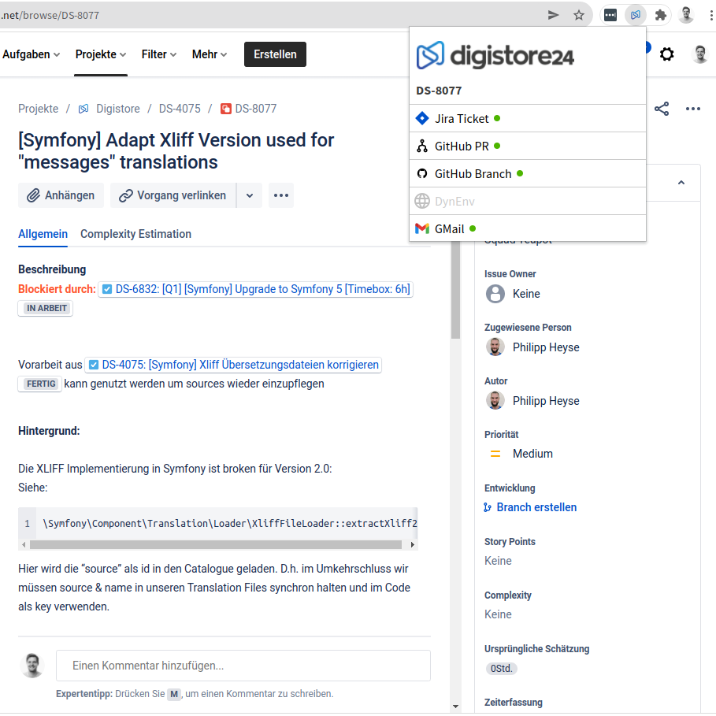

# DigiJump

**A Chrome/Chromium Extension providing a quick jump between Jira Tickets, GitHub PRs and DynEnv.**

Requires Chrome 88+. Not tested on Edge or Firefox.

## Features
### Jump to related Jira Tickets, Github PRs or Dynamic Environments
When viewing a Jira Ticket, a Github Pull Request or visiting an dynamic environment, the extension will offer related links to other environments.

### Quickly view a Pull Request by providing an id or a Jira Ticket by providing the Ticket number
Type `ds24` into the omnibar. The extension will try to find a Jira Ticket for you or, alternatively, a Github PR.
| Input   	| Redirect to                                       	|
|---------	|---------------------------------------------------	|
| DS-1234 	| https://digistore.atlassian.net/browse/1234       	|
| 772     	| https://github.com/hulkag/ds24-digistore/pull/772 	|

### Get common developer links
If not viewing a Jira Ticket or Pull Request, this extension show links to Github, Jira and the Scrum sprint overview.

## Installation

1. Download this repo as a ZIP file from GitHub.
2. Unzip the file and you should have a folder named `ds24-jump`.
3. In Chrome/Edge go to the extensions page (`chrome://extensions` or `edge://extensions`).
4. Enable Developer Mode.
5. Load the extensions:
   - Just Drag and Drop the .crx file in this directory to the extension overview
   - Alternatively, click to "Load unpacked". Then head to this directory and click "Load".

## Notes
* This extension heavily relies on making internal calls to github. You may need to login / authorize at github before open the extension popup.
* This extension is not tested on Edge.
* Local installed extensions are not auto-updated. So check version numbers in case of any updates and repeat the steps shown at "Installation"

## Support
If you have any problems or feature suggestions, you can submit a [new issue here](https://github.com/dsentker24/ds24-jump/issues/new/choose). I am happy about every PR and every issue.

### Ideas
- Search in Slack Messages
- Create k8s namespace command
- Use Github API instead of DOM crawling (Token required)